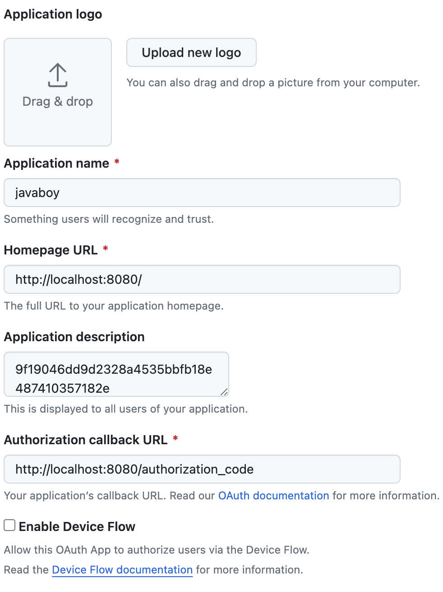
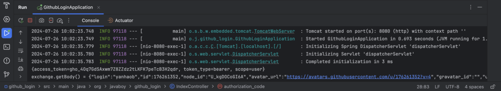
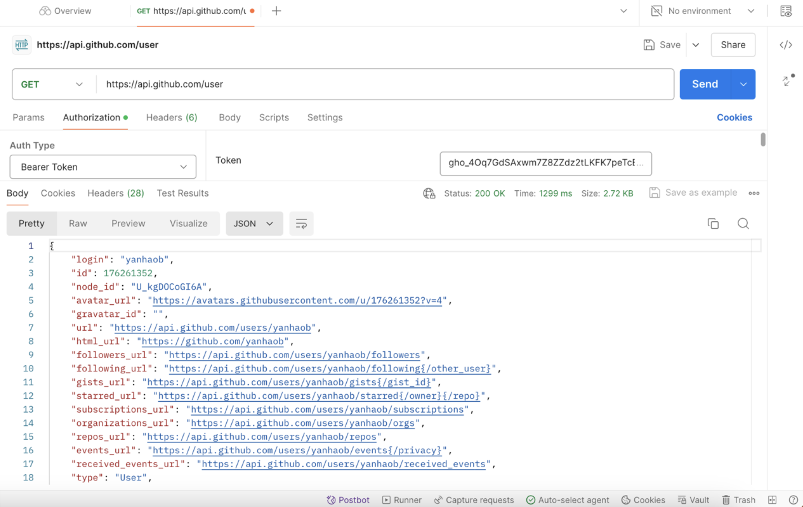

# wk5-oauth-jwt
https://github.com/lenve/oauth2-samples
https://www.javaboy.org/2020/0424/github-oauth2.html
https://www.javaboy.org/2020/0421/oauth2-jwt.html

Task1 is to setup OAuth authorization for Github and use Github's token as the user's basic identifier. Task2 is to setup JWT authentication: the front-end first carries a token in the header of each HTTP request, then the back-end verifies the validity period and legitimacy of the jwt token.

## OAuth

**Step1**, register a new OAuth application on Github ([Register Here](https://github.com/settings/applications/new)), configure as in the Fig.1 below.

Fig.1 Github OAuth Setup

then, cd github\_login/src/main/java/org/javaboy/github\_login/IndexController.java

and input your client\_id and client\_secret from your github oauth setup.

**Step2**, cd gnd run ithub\_login/src/main/java/org/javaboy/github\_login/GithubLoginApplication.java

as followed by the Fig.2 below. Save the terminal output:

{access\_token=gho\_4Oq7GdSAxwm7Z8ZZdz2tLKFK7peTcB3H2qdr, token\_type=bearer, scope=user}

    
    
Fig.2 OAuth

**Step3**, enter the token "gho\_4Oq7GdSAxwm7Z8ZZdz2tLKFK7peTcB3H2qdr" and configure as in the Fig.3 below, on [Postman](https://web.postman.co/workspace/My-Workspace~17dec501-2190-4fb7-8a43-d6953248e8f0/request/create?requestId=9d501966-0a07-471c-ae0f-5ca786e0ff62). Then click "Send".

    
    
Fig.3 OAuth Result

## JWT
**Step4**, 

